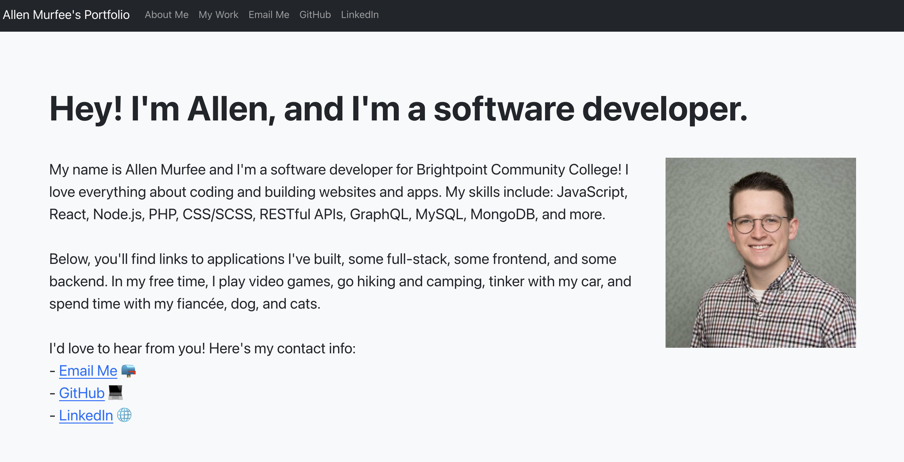

# My Portfolio

## Table of Contents

- [Description](#description)
- [Installation](#installation)
- [Usage](#usage)
- [Credits](#credits)
- [License](#license)

## Description

This is my professional portfolio website built with React. I am currently a software developer for Brightpoint Community College.

## Skills

JavaScript, React, React Native, CSS/SCSS, Node.js, PHP, MERN, REST APIs, Express.js, Bootstrap, OOP,
MySQL, NoSQL, MongoDB, GraphQL, Jest, jQuery, Sequelize, Mongoose, ES6, Git, CMS

## Installation

No installation is required. Please visit the [usage](#usage) section for the portfolio URL.

## Usage

Click this URL to view the page: https://allenmurfee.github.io/react-portfolio/

## Credits

No outside credit required.

## License

MIT License
