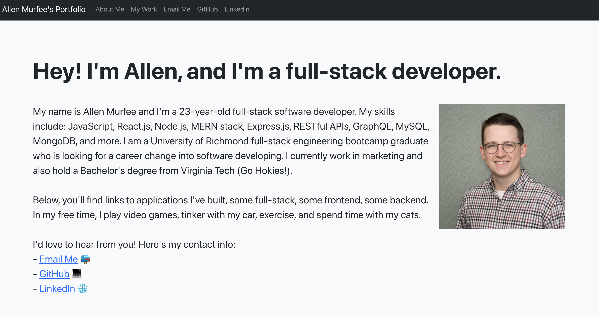

# My Portfolio

## Table of Contents

- [Description](#description)
- [Installation](#installation)
- [Usage](#usage)
- [Credits](#credits)
- [License](#license)

## Description

This is my professional portfolio website built with React to be updated whenever I have new applications I'd like to highlight. I am currently seeking employment as a web developer. I am a full-stack software development bootcamp graduate from the University of Richmond and hold a Bachelor's from Virginia Tech.

## Skills

JavaScript, React, CSS, Node.js, MERN, REST APIs, Redux, Express.js, PWAs, Bootstrap, OOP,
MySQL, NoSQL, MongoDB, GraphQL, Jest, jQuery, Sequelize, Mongoose, ES6, GitHub, Git

## Installation

No installation is required. Please visit the [usage](#usage) section for the portfolio URL.

## Usage

Click this URL to view the page: https://allenmurfee.github.io/react-portfolio/

## Credits

No outside credit required.

## License

MIT License
